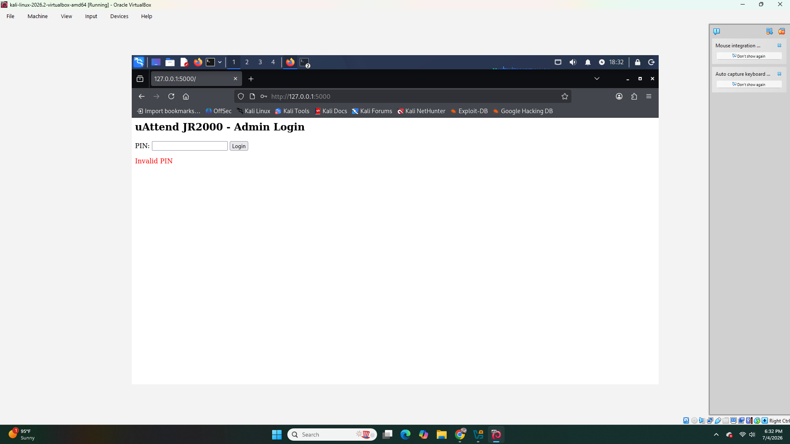
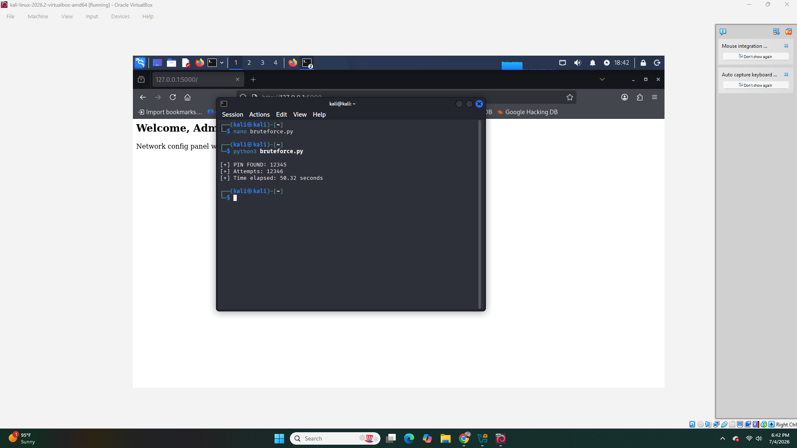
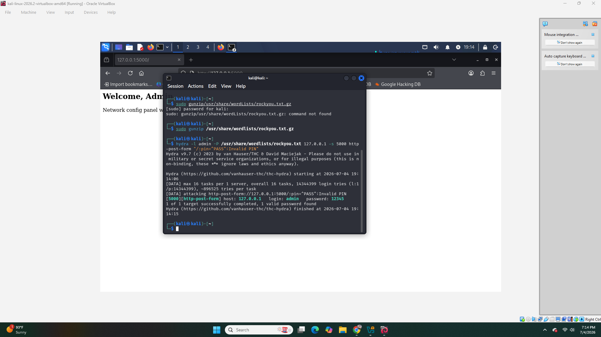
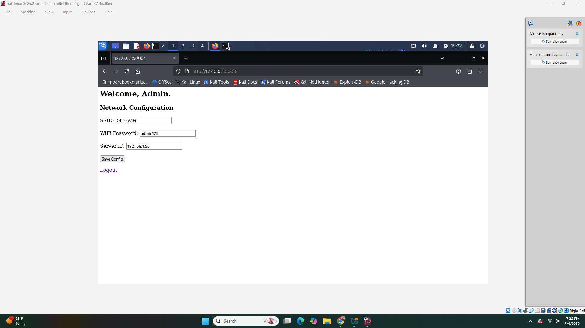
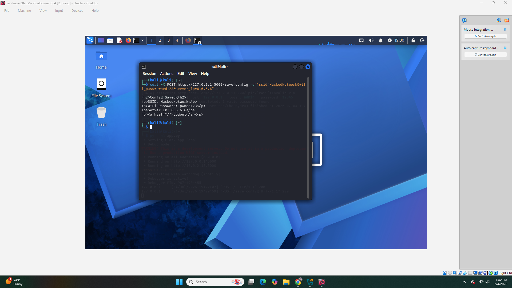
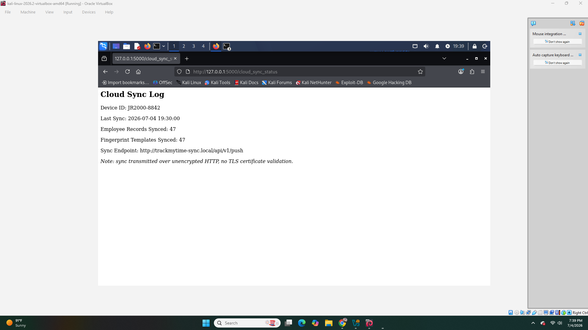

# Security Analysis of the uAttend JR2000 Biometric Time Clock

*Independent research into an undocumented IoT device class*

---

## Overview

The uAttend JR2000 is a biometric fingerprint time clock manufactured by Workwell Technologies, designed for small-to-medium business workforce management. It syncs employee attendance and fingerprint data to a cloud portal (trackmytime.com) over a local network connection.

Despite handling sensitive biometric data, uAttend/Workwell Technologies has no public CVE history,  a notable gap for a device category that has seen serious disclosed vulnerabilities in comparable products (see: ZKTeco's 2023 disclosures, including CVSS 10.0-rated command injection and arbitrary file write flaws).

This repository documents an independent research project examining common authentication and access-control patterns likely present in this device class, built and tested against a self-created replica rather than a live device.

---

## Methodology

This research followed a four-stage approach:

1. **Reconnaissance**: Reviewed publicly available JR2000 documentation (user manuals, setup guides) to understand the device's authentication flow, network configuration options, and cloud-sync behavior. Cross-referenced against disclosed vulnerabilities in comparable devices (ZKTeco) to identify likely risk patterns.
2. **Threat Modeling**: Identified the 5-digit admin PIN as the device's single root of trust for local configuration access, with the cloud portal (Company ID + email 2FA) as a secondary, softer attack surface.
3. **Proof-of-Concept Build**: Constructed a lightweight Flask application replicating the authentication and data-handling patterns inferred from documentation, to validate whether the suspected weaknesses would produce exploitable behavior in practice.
4. **Validation**: Tested each hypothesized vulnerability against the replica using both custom Python scripting and industry-standard tooling (Hydra), to confirm findings with reproducible evidence.

---

## Lab Setup Challenges

Building the testing environment surfaced a few real-world obstacles worth documenting:

* **VirtualBox VM registration conflict**: An interrupted/corrupted VM import created a duplicate UUID conflict, causing the imported Kali Linux machine to fail on boot ("Can't open machine" error, matching UUID as an existing VM). Resolved by removing the stale disk registration via Virtual Media Manager and re-registering the VM directly through its `.vbox` configuration file, rather than re-importing from scratch.
* **Scope decision**: The original lab design called for a three-VM network simulation (pfSense as network segment, Kali as attacker, separate Ubuntu VM as target device). This was scoped down to a single Kali VM running the vulnerable Flask replica locally, since a single-VM setup was sufficient to demonstrate and prove all four vulnerabilities — each finding lives at the application layer, not the network layer, so full network segmentation wasn't required to validate them.
* **Environment cleanup**: Package management (`apt upgrade`) and port conflicts (Flask dev server holding port 5000 across restarts) required basic Linux process management (`fuser`, `pkill`) to keep the test environment stable during iterative development.

---

## Findings

### 1. Weak PIN Authentication

**Description:** The JR2000's admin authentication relies on a single 5-digit numeric PIN, user-set during initial device setup with no enforced complexity requirements or forced rotation policy documented in the manual.

**Impact:** A 5-digit numeric PIN has only 100,000 possible combinations, it is trivially exhaustible without any specialized hardware.

**Proof-of-Concept:** Built a Flask replica implementing this exact authentication pattern (PIN: `12345`).

**Evidence:**

---

### 2. No Rate Limiting / Brute-Force Protection

**Description:** The login endpoint imposes no lockout, delay, or attempt-limiting mechanism, allowing unlimited sequential authentication attempts.

**Impact:** Combined with Finding #1, this makes full PIN-space exhaustion practical rather than theoretical.

**Proof-of-Concept:** Two independent brute-force validations:

* Custom Python script: full PIN found in **50.32 seconds**, 12,346 attempts
* Hydra (industry-standard tool): confirmed same result, 1/1 target successfully completed

**Evidence:**

---

### 3. Broken Access Control

**Description:** The network configuration save endpoint (`/save_config`) performed no session or authentication validation, it could be reached directly via a crafted request, entirely bypassing the PIN login screen.

**Impact:** An attacker who discovers or guesses the endpoint path can modify device network configuration (SSID, WiFi credentials, server IP) without ever authenticating.

**Proof-of-Concept:** Direct `curl` POST request to the endpoint succeeded without a prior login session.

**Evidence:**

*The legitimate config panel, reached normally via the PIN login:*

*The same endpoint reached directly via curl, with zero authentication:*

---

### 4. Unauthenticated, Unencrypted Cloud Sync Exposure

**Description:** A cloud-sync status endpoint exposed device metadata (device ID, sync timestamps, employee/fingerprint record counts, sync endpoint URL) without requiring authentication, and explicitly noted transmission occurs over unencrypted HTTP with no TLS certificate validation.

**Impact:** Exposes operational metadata about a business's workforce (headcount, biometric enrollment status) to anyone who can reach the endpoint, and highlights a transport-layer weakness in the cloud-sync design pattern.

**Proof-of-Concept:** Direct GET request to the endpoint returned full sync metadata with no login required.

**Evidence:**

---

## Recommendations

|Finding|Recommendation|
|-|-|
|Weak PIN Authentication|Enforce longer alphanumeric credentials instead of 5-digit numeric PINs; require periodic rotation|
|No Rate Limiting|Implement account lockout after N failed attempts, with exponential backoff or CAPTCHA on repeated failures|
|Broken Access Control|Enforce server-side session validation on all state-changing endpoints, not just the login page|
|Unauthenticated Cloud Sync|Require authentication on all data-exposing endpoints; enforce TLS/HTTPS with certificate validation for any cloud-sync transport|

These are standard, low-cost mitigations — none require significant architectural changes, which makes their absence in budget IoT devices more a design oversight than a technical limitation.

---

## Disclaimer

This project is an independent security research exercise conducted for educational purposes. No production uAttend device, Workwell Technologies infrastructure, or real customer data was accessed, tested, or compromised at any point.

All findings in this repository are based on:

* Publicly available product documentation (user manuals, setup guides)
* Comparative analysis of disclosed vulnerabilities in similar biometric/IoT time-clock devices (e.g., ZKTeco's publicly documented CVEs)
* A self-built Flask application replicating plausible authentication and data-handling patterns common to this device class, based on the above sources

The vulnerabilities demonstrated (weak PIN authentication, lack of rate limiting, broken access control, unauthenticated data exposure) are **common patterns across budget IoT devices generally**, not confirmed flaws in any specific commercial product. This research aims to raise awareness of common IoT security anti-patterns, not to single out or discredit any manufacturer.

If Workwell Technologies or any similar vendor identifies this work and wishes to discuss it, I welcome that conversation.

